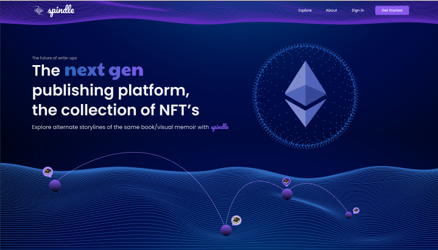

# Spindle

> Spindle is an NFT marketplace that doubles up as a publishing platform which lets writers mint their NFTs and allow their readers to indulge in alternate plotlines or treasure a visual memoir.

  

### Advantages of NFTs for writer:

##### Special and Limited Editions
Writer can create special or limited editions of the books.

##### Signed Copies
An author could also create copies with a limited number of digitally signed copies of a work.

##### Bonuses
Making the owner special and providing him with special and alternative storylines when he buys the book.

## Running the app

Follow these steps to run Spindle !!

1. Clone this repo
2. Run `yarn install`
3. Run `yarn chain`
4. Run `yarn start` and then finally `yarn deploy`
5. Ta da !!

### Tech Stack

1. React for frontend 
2. Filecoin for storage and to avoid censorship
3. Chainlink oracle to make API requests 
4. Superfluid to stream the money paid by the buyers to the creator
5. Polygon (Matic) for less gas costs and easy deployment
6. Portis for smooth user experience for buyers who are not equipped with blockchain extensions
7. The Graph for indexing the CIDs
8. Dynamic Access Control by NuCypher for ensuring only the buyers have access to the complete article / book

